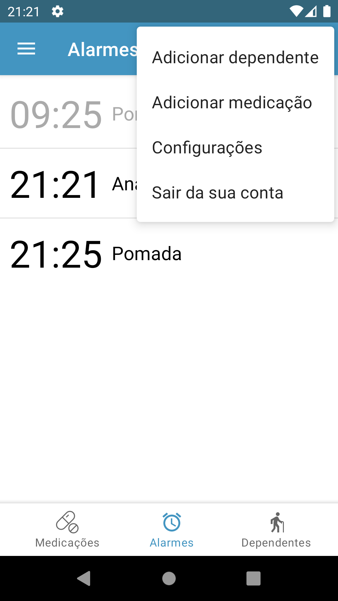

# De 12 em 12 horas

Este aplicativo busca ajudar pacientes e cuidadores a respeitarem seus horários de medicações por meio de alarmes e notificações.
O projeto está [disponível](https://play.google.com/store/apps/details?id=com.gafeol.dozeemdoze) gratuitamente para dispositivos Android na Play Store.

Utilizando o aplicativo é possível cadastrar qualquer tipo de medicação de uso contínuo e configurar alarmes de lembretes para o horário de cada dose desta medicação.

É possível também realizar o cadastro de dependentes, pessoas que recebem seu auxílio no controle das medicações. Cada dependente pode ter, por sua vez, um cadastro de medicações próprias ou de alarmes.

## Capturas de tela

## Créditos dos ícones e imagens usadas

As imagens utilizadas no aplicativo foram retiradas de www.flaticon.com, desenhadas por:

- Prescrição (ic_prescription), Pílula redonda (ic_round_medicine), pílula longa (ic_long_medicine), ícones de pessoas (ic_old_man e ic_old_woman) por [Freepik](http://www.freepik.com/).
- Injeção (ic_injection) por [Nikita Golubev](https://www.flaticon.com/authors/nikita-golubev).
- Dependentes por [Vitaly Gorbachev](https://www.flaticon.com/authors/vitaly-gorbachev) e [Freepik](http://www.freepik.com/).

Logo do projeto desenvolvido a partir da imagem [24-hours](https://www.flaticon.com/free-icon/24-hours_899061?term=hours&page=1&position=1&page=1&position=1&related_id=899061&origin=search) de [Srip](https://www.flaticon.com/authors/srip).

Logo utilizado na tela de alarme (ic_alarm_clock) também desenvolvido por [Srip](https://www.flaticon.com/authors/srip).
